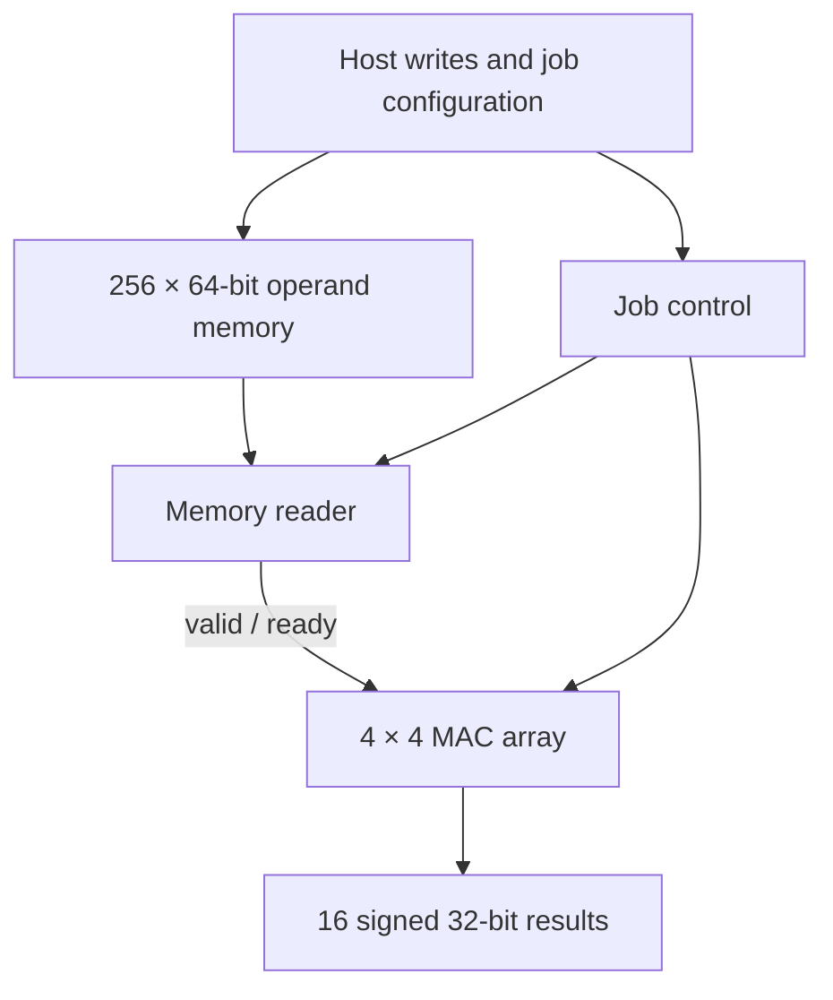

# INT8 Matrix Engine: RTL to Physical Design

A 4×4 INT8 matrix-multiplication engine implemented in SystemVerilog and studied with Cadence Xcelium, Genus, Innovus, and Tempus using an academic 45 nm library. The repository name reflects the longer-term CNN goal; convolution scheduling, requantization, and full CNN inference are future work.

## Architecture



`accel_top` integrates memory, reader, and the configurable-K compute engine. Each memory word packs `{B3, B2, B1, B0, A3, A2, A1, A0}`: column k of A and row k of B. Sixteen signed INT8 MACs accumulate the output matrix for K=1–255. The memory is implemented from behavioral RTL; this flow does not use an SRAM macro. The optional `MAC_PIPE` build registers the product before accumulation.

## Results

| Stage / variant | Recorded result |
|---|---|
| Baseline RTL verification | MAC: 132,084 checks; array: 103 tests; configurable K: 11 jobs |
| Memory and reader verification | Memory: 526 cycle checks; reader: 5 jobs / 267 words |
| Integrated top, baseline | Identity and accumulation tests: 16 result comparisons each |
| Original MAC synthesis, 2.22 ns target | Reported WNS 0.0 ps; cell area 136,950.600 µm² |
| Pipelined MAC synthesis, 2.00 ns target | Reported WNS 0.0 ps; cell area 137,049.660 µm² |
| Pipelined routed design, 2.00 ns target | Innovus reports zero DRC, connectivity, and process-antenna violations |
| Same routed design, Tempus | Setup WNS −0.002 ns (1 path); hold WNS −0.007 ns (31 paths) |

**500 MHz is a tested target, not a timing-closed operating frequency.** Tempus also reports constraint-coverage warnings. See the [physical-design report](reports/08-physical-design-clock-sweep.md) and [raw evidence](reports/evidence/physical/README.md). Power reports are tool estimates under the recorded activity assumptions, not silicon measurements.

## Run the integrated RTL tests

From the repository root, in a university-configured Cadence **tcsh** session:

```tcsh
source scripts/run_top.tcsh
```

This runs the identity test followed by the accumulation test. Inspect both logs for PASS. The recorded passes above concern the baseline; this update does not claim a new simulation run or a verified pipelined regression. See [reproduction instructions](docs/reproduce-physical.md) for build variants and the synthesis-to-Tempus flow.

## Repository map

- `rtl/`, `tb/`: RTL and self-checking testbenches.
- `scripts/`: simulation, synthesis, implementation, STA, LEC, and clock-sweep scripts.
- `constraints/`: SDC and the Run 2 MMMC template.
- `reports/`: milestone explanations, recorded results, and curated evidence.
- `docs/`: reproduction instructions and remaining work.
- `runs/`: generated local outputs; excluded from Git.

## Scope and provenance

The baseline simulations and physical-design results were produced on the university Cadence installation. The report files preserve their run dates and tool versions. Original import details and source hashes are in [baseline provenance](reports/00-baseline-import.md); later milestones have separate reports. The accumulated-matrix PASS transcript was shared during development; the archive supplied for this update does not include that simulation log.

Final pipelined RTL regression and LEC pass evidence are still needed. Remaining work includes timing/constraint closure and CNN functionality; see the [roadmap](docs/roadmap.md). Technology libraries, corrected library copies, tool databases, and license settings are not distributed.
